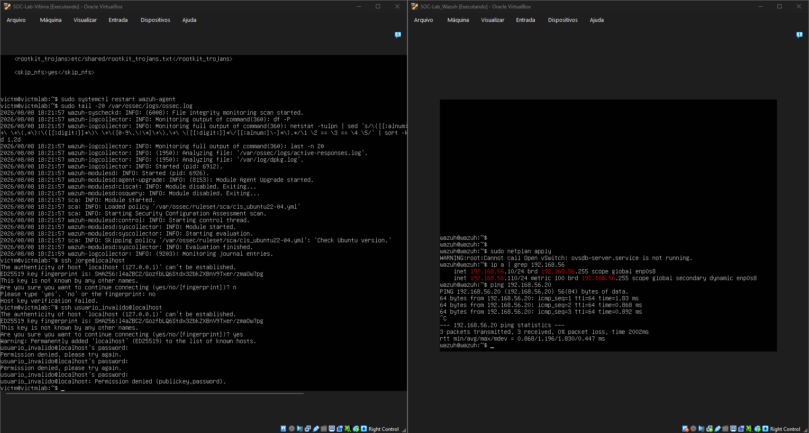
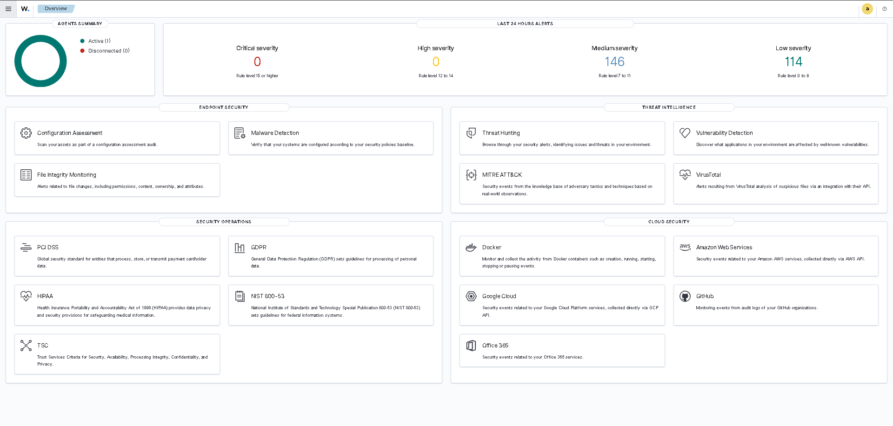
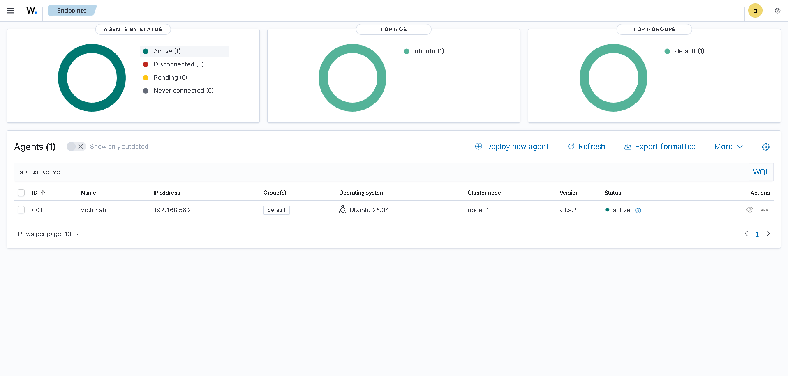
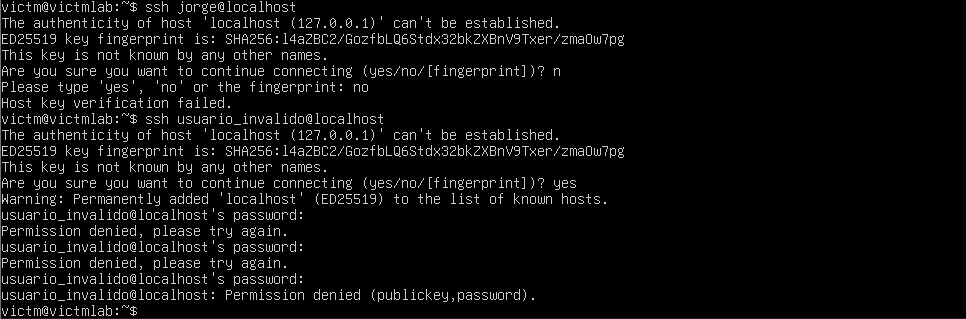
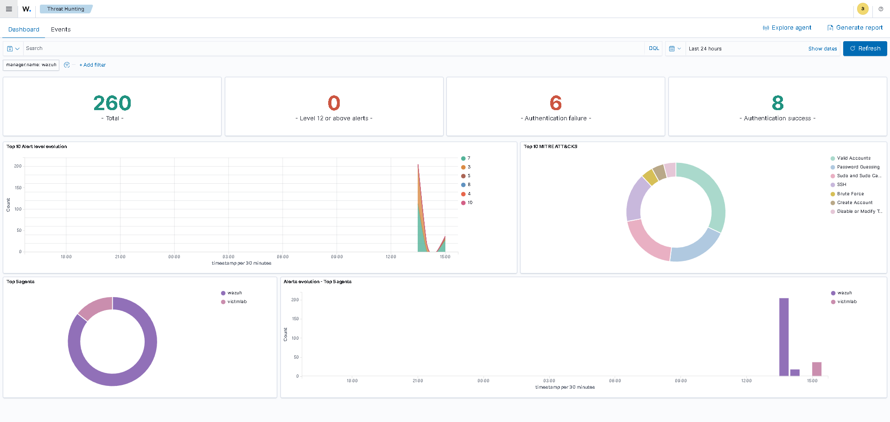
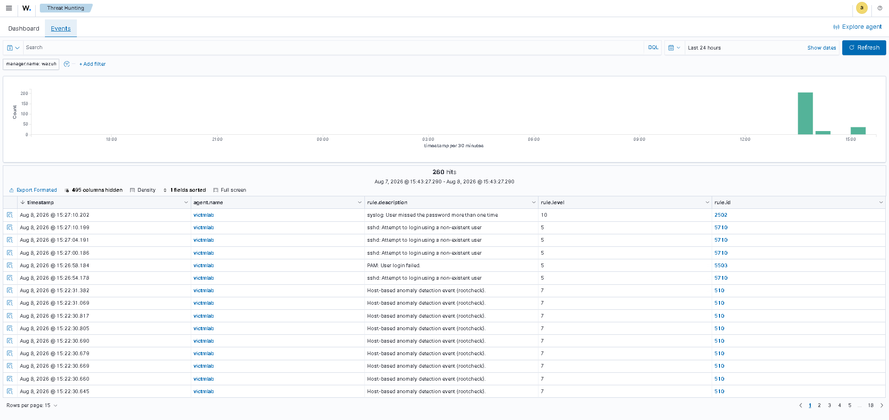
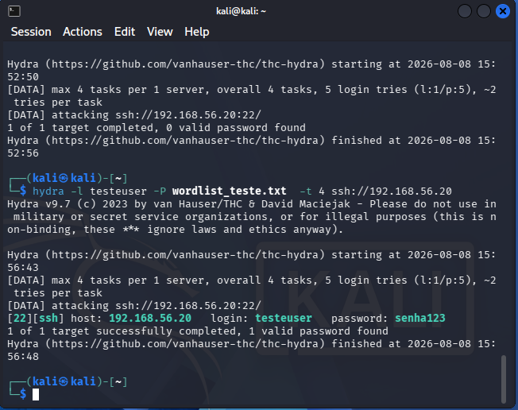
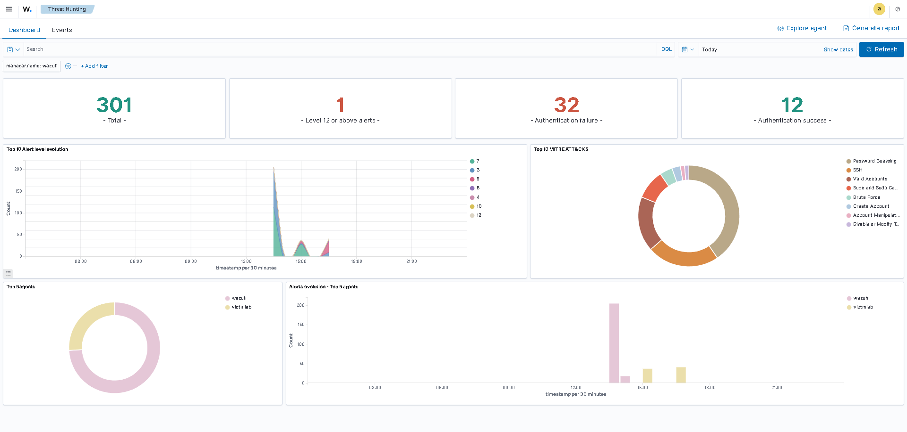
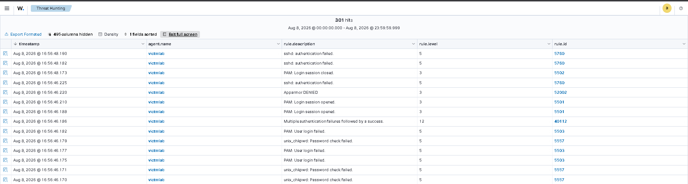

# Home SOC Lab — Wazuh SIEM

Ambiente de laboratório pessoal para estudo prático de monitoramento de segurança (SOC),
usando Wazuh como SIEM para detecção de eventos em tempo real, com simulação de ataques
reais usando ferramentas de pentest (Nmap, Hydra).

## Objetivo

Simular um ambiente básico de SOC para praticar:

- Coleta e correlação de logs
- Detecção de tentativas de acesso não autorizado (SSH brute-force)
- Análise de alertas de segurança
- Execução de ataques controlados e análise da capacidade de detecção do SIEM

## Arquitetura

- **VM 1 — Wazuh Server** (Ubuntu Server 22.04 LTS): Indexer + Manager + Dashboard
- **VM 2 — Vítima/Endpoint** (Ubuntu Server): Wazuh Agent monitorando eventos locais
- **VM 3 — Atacante** (Kali Linux): geração de ataques controlados (Nmap, Hydra)
- Rede interna isolada (VirtualBox Host-only, `192.168.56.0/24`)
  - Wazuh Server: `192.168.56.10`
  - Vítima/Endpoint: `192.168.56.20`
  - Atacante (Kali): `192.168.56.30`

## Ferramentas utilizadas

- VirtualBox
- Wazuh 4.9.2 (Indexer, Server, Dashboard, Agent)
- Ubuntu Server 22.04 LTS
- Kali Linux
- Nmap
- Hydra (THC-Hydra)

## O que foi feito

1. Provisionamento de três VMs em rede isolada (Host-only)
2. Instalação e configuração do Wazuh Server (Indexer + Manager + Dashboard)
3. Instalação do Wazuh Agent no endpoint monitorado
4. Registro e conexão do agente ao servidor
5. Simulação manual de tentativas de login SSH falhadas
6. Verificação da detecção do evento no Dashboard do Wazuh
7. Reconhecimento de rede com Nmap contra o endpoint vítima, a partir do Kali
8. Simulação de ataque de força bruta SSH usando Hydra (ferramenta real de pentest),
   com wordlist customizada, resultando em comprometimento bem-sucedido da conta de teste
9. Verificação da detecção completa do ataque no Dashboard: sequência de tentativas
   falhadas seguida do login bem-sucedido

## Evidências

### Ambiente rodando

### Dashboard do Wazuh — login

### Agente conectado e ativo

### Tentativa manual de SSH sendo gerada

### Alerta detectado no Dashboard (teste manual)

### Detalhe do alerta (teste manual)

### Ataque de força bruta automatizado com Hydra

### Alerta do ataque Hydra detectado no Dashboard

### Detalhe do alerta do ataque Hydra

## Insight técnico — limitação identificada

Durante testes de reconhecimento com Nmap, foi identificado que o Wazuh **não detecta
scans de portas por padrão**, pois monitora logs de sistema (autenticação, integridade
de arquivos, processos), não tráfego de rede bruto. A detecção de scans exigiria a
integração de um IDS de rede, como o **Suricata**, alimentando o Wazuh com uma fonte
de dados adicional.

Esse é um próximo passo natural de evolução do ambiente (ver "Próximos passos" abaixo).

## Desafios técnicos enfrentados e resolvidos

Durante a montagem do ambiente, enfrentei e resolvi problemas reais de infraestrutura:

- **Instabilidade de CPU (soft lockup)** no Wazuh Indexer durante a instalação,
  resolvida ajustando a interface de paravirtualização do VirtualBox (de Hyper-V
  para Default) e o plano de energia do host
- **Incompatibilidade de versão do sistema operacional**: Wazuh 4.9.2 não é
  compatível oficialmente com Ubuntu 24.04, exigindo reinstalação da VM com
  Ubuntu 22.04 LTS
- **Espaço em disco insuficiente**, causando falha na instalação do Wazuh Dashboard;
  resolvido limpando cache do `apt` e liberando espaço
- **Portas ocupadas (1515, 55000)** por processos remanescentes de tentativas de
  instalação anteriores, resolvido identificando e finalizando os processos manualmente
- **Incompatibilidade de versão entre agente e servidor**: o agente instalado via
  repositório trouxe uma versão mais recente (4.14.7) que o manager (4.9.2), resolvido
  fixando a versão exata do pacote na instalação
- **Configuração de rede interna (Host-only)** entre as três VMs via netplan (Ubuntu)
  e nmcli (Kali), incluindo identificação de perfis de conexão de rede incorretos
- Ajuste de `vm.max_map_count` exigido pelo OpenSearch/Indexer

## Próximos passos

- [ ] Criar regra de detecção customizada para padrão de brute-force (múltiplas
      falhas seguidas de sucesso, mesmo usuário, curto intervalo de tempo)
- [ ] Integrar Suricata (IDS de rede) para detectar varreduras de porta (Nmap)
- [ ] Testar módulo de File Integrity Monitoring (FIM) do Wazuh
- [ ] Documentar relatório de incidente estruturado (ver `docs/incident-report.md`)
- [ ] Testar cenário de exfiltração simulada via SCP
